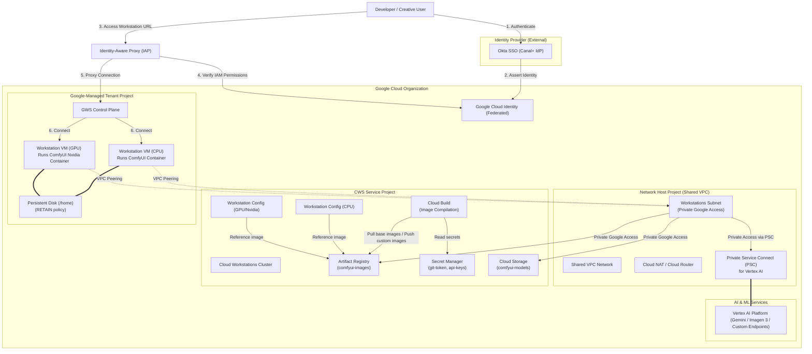

# Cloud Workstations Reference Architecture

This document describes the reference architecture for deploying Cloud Workstations (CWS) for ComfyUI and creative workloads inside an enterprise environment, such as Canal+. It details identity federation, network layout, tenant project isolation, and integration with Vertex AI services.

## Architecture Diagram

The diagram below shows how the different projects, network components, and identity providers connect to provide a secure developer workspace:

## Architectural Design

### 1. Identity Federation (Okta & Cloud Identity)
* **Identity Provider (IdP)**: Corporate user accounts are managed in an external IdP (Okta). Okta is federated with Google Cloud Identity to enable single sign-on.
* **Identity-Aware Proxy (IAP)**: IAP acts as the gatekeeper for all workstation traffic. It intercepts requests, validates the federated credentials, checks IAM access permissions (`roles/workstations.user`), and forwards the connection.

### 2. Multi-Project and Peering Layout
* **Host Project (Shared VPC)**: Centralizes networking. The workstation VMs consume internal IP addresses in a Shared VPC subnet. 
  * **Private Google Access**: Configured on the subnet, allowing VMs to talk to Google APIs (such as Artifact Registry and Cloud Storage) privately without using external IP addresses.
* **Service Project**: Contains the workstation configurations and build pipelines.
* **Google-Managed Tenant Project**: Isolates GKE clusters and persistent storage volumes managed by Google. Network connectivity between the tenant VMs and the Shared VPC subnet is established automatically using VPC Network Peering.

### 3. Machine Learning (Vertex AI Integration)
* **API Access**: ComfyUI workloads execute API calls to Vertex AI models.
* **Private Service Connect (PSC)**: To maintain a completely private networking space, a PSC endpoint is deployed inside the Shared VPC. Vertex AI API traffic is directed to this endpoint, ensuring data never transits over the public internet.
* **Access Control**: Workstation service accounts are assigned the `roles/aiplatform.user` role to authenticate using Google Application Default Credentials (ADC).

---

For additional information on Cloud Workstations network security and deployment patterns, see:
* [Cloud Workstations architecture](https://cloud.google.com/workstations/docs/architecture)
* [Shared VPC overview](https://cloud.google.com/vpc/docs/shared-vpc)
* [Private Service Connect overview](https://cloud.google.com/vpc/docs/private-service-connect)

